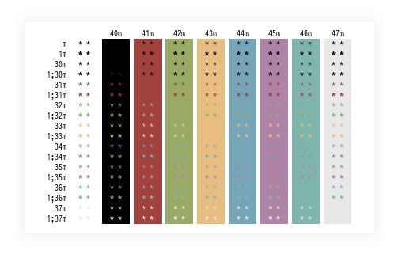
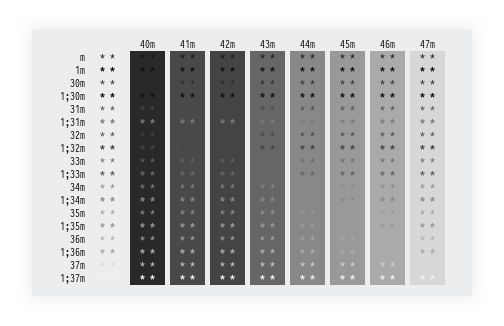
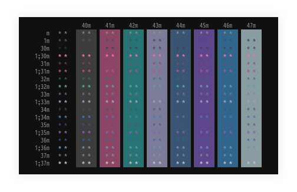
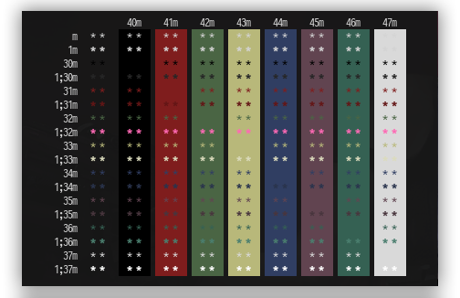
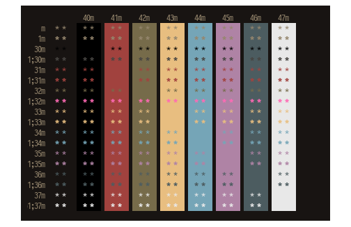

Terminal Schemes
=========
Color schemes for default Linux

### oolo

_file `.terminal.oolo` [+1](https://github.com/appath/Terminal/blob/master/schemes/.terminal.oolo)

### sulfur

_file `.terminal.sulfur` [+2](https://github.com/appath/Terminal/blob/master/schemes/.terminal.sulfur)

### bbit

_file `.terminal.bbit` [+3](https://github.com/appath/Terminal/blob/master/schemes/.terminal.bbit)

### bspwm

_file `.terminal.bspwm` [+4](https://github.com/appath/Terminal/blob/master/schemes/.terminal.bspwm)

### anonymous

_file `.terminal.bspwm` [+5](https://github.com/appath/Terminal/blob/master/schemes/.terminal.anonymous)

Resources
=========
_Note WIKI ArchLinux '[X resources](https://wiki.archlinux.org/index.php/X_resources)'
